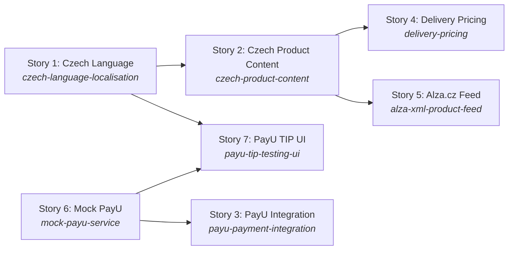

# Plan: ToolShop Czech Market Entry — Sprint 6

## Roadmap Overview

This plan implements the ToolShop Czech Market Entry (Sprint 6 / HOLTES) across seven independently sequenced stories, covering Czech localisation, Czech product content, PayU payment integration, weight-based delivery pricing, an Alza.cz XML product feed, a mock PayU service for QA, and a PayU TIP testing UI. The stack is Laravel (PHP, PHPUnit) on the backend and Angular 17 + Transloco + Jasmine/Karma on the frontend.

Two parallel tracks run through the sprint. Track A (language → content → delivery/Alza) expands the customer-facing product and checkout experience. Track C (mock PayU → real PayU) delivers payment infrastructure. Both tracks converge at the PayU TIP UI in Story 7. Stories 1 and 6 have no predecessor dependencies and can start simultaneously at sprint kick-off.

Total complexity distribution: 2 × M (Stories 6, 7), 4 × M (Stories 1, 2, 4, 5), 1 × L (Story 3). All stories are within the ≤15-file limit. Estimated stories on the critical path: 3 (S1 → S2 → S4 or S5).

> ⚠️ **Alza.cz schema blocker:** The Alza.cz XML feed schema must be obtained from the Alza.cz Partner Portal before Story 5 can enter implementation. The Field Mapping Table below is therefore PENDING. Do not start Story 5 (`specify-task`) until the schema has been received and this table is completed.

---

## Dependency Graph

---

## Stories

### Story 1: Czech Language & Localisation

- **Slug:** `czech-language-localisation`
- **Description:** Integrate Transloco for Czech locale support in the Angular frontend. Add a language-switcher component to the shared header/navigation bar that lets customers select Czech or English at any time during the session. Wire up cookie-based language persistence so the selected locale is stored in a browser cookie (`lang`) on selection and restored when the app initialises. Supply the Czech translation JSON file covering all navigation elements, buttons, labels, headings, checkout step copy, form field labels, and validation/error messages. Add a Laravel locale middleware that reads the `lang` cookie and sets the application locale on each request for any server-rendered strings.
  - **Key files (estimated):** `LanguageSwitcherComponent`, `LanguageSwitcherModule` (or standalone component), `CookieLanguageService`, `AppComponent` (header outlet), `assets/i18n/cs.json`, `assets/i18n/en.json`, Laravel `SetLocale` middleware, Laravel `Kernel.php` (middleware registration).
  - **Does not include:** Czech product content fields in the DB (Story 2), translation of the PayU TIP page (Story 7 — that page is English-only by design).
- **Business Acceptance Criteria covered:** BAC-1, BAC-2, BAC-3, BAC-4, BAC-5
- **Complexity:** M (~8 files)
- **Dependencies:** None
- **Independently deployable:** Yes — changes are additive (new component, new translation files). The English locale remains default; no existing functionality is altered.
- **Test names:**
  - `test_language_switcher_renders_on_all_customer_facing_pages` (Angular unit) → BAC-1
  - `test_selecting_czech_switches_active_translations_without_page_reload` (Angular unit) → BAC-2
  - `test_language_preference_written_to_lang_cookie_on_selection` (Angular unit) → BAC-3
  - `test_lang_cookie_read_on_app_init_restores_czech_locale` (Angular unit) → BAC-3
  - `test_checkout_step_labels_use_czech_translation_keys_when_locale_is_cs` (Angular unit) → BAC-4
  - `test_form_validation_messages_rendered_from_czech_translation_file` (Angular unit) → BAC-5

---

### Story 2: Czech Product Content

- **Slug:** `czech-product-content`
- **Description:** Add Czech-language content fields (`title_cs`, `description_cs`, `specs_cs`) to the products table via a Laravel migration. Extend the `Product` model with these fields and a `localise(string $locale)` helper that returns the Czech content when `$locale === 'cs'` and falls back to English when the Czech fields are empty or null. Update `ProductRepository` / `ProductController` to pass the resolved locale to the product when responding to listing, detail, search, and cart/checkout overview requests. No new views are created — existing listing and detail view templates read `$product->title` etc., so `localise()` sets those attributes at resolution time (or equivalent approach consistent with the existing codebase pattern). Ensure special Czech characters (diacritics) are stored and rendered correctly (UTF-8 throughout).
  - **Key files (estimated):** Migration `add_czech_fields_to_products_table`, `Product.php` model, `ProductRepository.php`, `ProductController.php`, `SearchController.php`, `CartController.php` (or equivalent checkout overview endpoint).
  - **Does not include:** Weight field (Story 4 — separate migration to avoid conflicts); Czech translation JSON for UI strings (Story 1).
  - **File-overlap note:** This story adds columns to the `products` table and modifies `Product.php`. Story 4 (Delivery Pricing) also adds a column to `products` and modifies `Product.php`. Story 4 must be sequenced after this story.
- **Business Acceptance Criteria covered:** BAC-6, BAC-7, BAC-8, BAC-9
- **Complexity:** M (~6 files)
- **Dependencies:** Story 1 must complete first (language infrastructure must exist for locale-resolution tests to pass end-to-end; the locale is set by the Laravel middleware introduced in Story 1).
- **Independently deployable:** Yes — new DB columns are nullable; existing English-only products continue to render in English with no breakage.
- **Test names:**
  - `test_product_with_czech_fields_returns_czech_title_when_locale_is_cs` (Laravel unit) → BAC-6
  - `test_product_with_czech_fields_returns_czech_description_on_detail_when_locale_is_cs` (Laravel unit) → BAC-6
  - `test_product_without_czech_fields_falls_back_to_english_title` (Laravel unit) → BAC-7
  - `test_product_without_czech_fields_falls_back_to_english_description` (Laravel unit) → BAC-7
  - `test_search_results_include_czech_titles_when_locale_is_cs` (Laravel unit) → BAC-8
  - `test_cart_line_item_shows_czech_product_title_when_locale_is_cs` (Laravel unit) → BAC-9

---

### Story 3: PayU Payment Integration

- **Slug:** `payu-payment-integration`
- **Description:** Integrate PayU Czech Republic as a real payment method for Czech customers. Add a `PayUClient` service that wraps the PayU CZ REST API (base URL from `.env`), covering order creation and status polling. Update the checkout payment step to display a "PayU" radio button only when the customer's billing or shipping address country is `CZ`. On confirmation, `PaymentController@check` for `payment_method: payu-cz` forwards payment data to `PayUClient`, handles the redirect URL returned by PayU, and maps the gateway callback (webhook) to an order status update. Register a signed webhook route (`POST /payment/payu/callback`) that verifies PayU's HMAC signature before updating order status. Ensure no card numbers, CVV codes, or raw gateway credentials are persisted in the database — only the PayU `transaction_id` and `order_status` are stored on the order record.
  - **Key files (estimated):** `PayUClient.php`, `PaymentController.php` (payu-cz branch), `PayUWebhookController.php`, `routes/api.php` (webhook route), `CheckoutPaymentComponent` (Angular — adds PayU radio option, country guard), `environment.ts` (PayU API URL), `.env.example` (PayU credentials template).
  - **Security notes:** HMAC signature verification is mandatory on the webhook before any DB write. No raw card data touches the application layer — PayU handles card capture on their hosted page. `PayUClient` reads credentials from `.env` only; no hardcoded secrets.
  - **References:** [PayU Czech Republic Developer Docs](https://developers.payu.com/en/) — implementation spec must fetch the API reference before coding begins. PayU CZ sandbox credentials required for integration test (see External Action Items).
- **Business Acceptance Criteria covered:** BAC-10, BAC-11, BAC-12, BAC-13, BAC-14
- **Complexity:** L (~10 files)
- **Dependencies:** Story 6 (Mock PayU) must complete first — `PaymentController` and `CheckoutPaymentComponent` baseline is established there; Story 3 extends it with the real PayU flow.
- **Independently deployable:** Yes with feature flag — PayU option is gated by address country (`CZ`). Non-Czech checkouts are unaffected. PayU can be enabled/disabled via `.env` without a deployment.
- **Test names:**
  - `test_payu_option_displayed_when_billing_country_is_cz` (Laravel unit) → BAC-10
  - `test_payu_option_displayed_when_shipping_country_is_cz` (Laravel unit) → BAC-10
  - `test_payu_option_not_displayed_for_non_czech_billing_and_shipping_address` (Laravel unit) → BAC-11
  - `test_successful_payu_gateway_response_creates_order_with_payment_confirmed_status` (Laravel integration) → BAC-12
  - `test_declined_payu_gateway_response_returns_error_and_does_not_create_order` (Laravel integration) → BAC-13
  - `test_cancelled_payu_checkout_allows_customer_to_retry_without_restarting` (e2e) → BAC-13
  - `test_payu_order_record_contains_no_card_number_cvv_or_raw_credentials` (Laravel unit) → BAC-14

---

### Story 4: Delivery Pricing

- **Slug:** `delivery-pricing`
- **Description:** Replace the current flat-rate delivery cost (€7.90) with a weight-and-region-based pricing model. Add a `weight` (decimal, kg) column to the `products` table via a new migration. Introduce a `DeliveryPricingService` that takes shipping country, billing country, and cart total weight, resolves the shipping region (CZ / DACH / EU / US / Others), determines the weight tier (Light < 10 kg / Heavy ≥ 10 kg), selects the delivery currency (CZK when billing country = CZ, otherwise USD), and returns the available delivery options with prices matching the matrix defined in US4200. Add Zásilkovna (`zasilkova`) as a delivery option, gated to CZ and DACH shipping addresses. Update the checkout delivery step to invoke `DeliveryPricingService` and render the options list. Apply new pricing only to orders created after deployment; in-flight orders retain their original flat rate.
  - **Pricing matrix** is authoritative in US4200 (`toolshop-v6/US4200-delivery-costs.md`) — implementation spec must embed it verbatim.
  - **Key files (estimated):** Migration `add_weight_to_products_table`, `Product.php` model (weight attribute), `DeliveryPricingService.php`, `DeliveryController.php` (or checkout delivery step handler), checkout delivery view/component.
  - **File-overlap note:** Modifies `Product.php` (adds `weight`). This story is sequenced after Story 2, which also modified `Product.php`.
- **Business Acceptance Criteria covered:** BAC-15, BAC-16, BAC-17, BAC-18, BAC-19
- **Complexity:** M (~6 files)
- **Dependencies:** Story 2 must complete first (avoids merge conflict on `Product.php` and `products` table migration).
- **Independently deployable:** Yes — Zásilkovna and weight-tier logic are additive. The old flat-rate default can be kept as the `Others / Light` USD fallback until pricing data is confirmed for all regions.
- **Test names:**
  - `test_standard_delivery_available_for_cz_shipping_region` (Laravel unit) → BAC-15
  - `test_standard_delivery_available_for_eu_shipping_region` (Laravel unit) → BAC-15
  - `test_standard_delivery_available_for_us_shipping_region` (Laravel unit) → BAC-15
  - `test_standard_delivery_price_matches_matrix_for_all_region_weight_combinations` (Laravel unit) → BAC-15
  - `test_zasilkovna_available_for_czech_republic_shipping_address` (Laravel unit) → BAC-16
  - `test_zasilkovna_available_for_dach_shipping_address` (Laravel unit) → BAC-16
  - `test_zasilkovna_not_shown_for_eu_non_dach_shipping_address` (Laravel unit) → BAC-17
  - `test_zasilkovna_not_shown_for_us_shipping_address` (Laravel unit) → BAC-17
  - `test_light_weight_tier_applied_when_cart_total_weight_below_10kg` (Laravel unit) → BAC-18
  - `test_heavy_weight_tier_applied_when_cart_total_weight_is_10kg_or_more` (Laravel unit) → BAC-18
  - `test_delivery_price_displayed_in_czk_for_czech_billing_country` (Laravel unit) → BAC-19
  - `test_delivery_price_displayed_in_usd_for_non_czech_billing_country` (Laravel unit) → BAC-19

---

### Story 5: Alza.cz XML Product Feed

- **Slug:** `alza-xml-product-feed`
- **Description:** Implement an authenticated XML product feed endpoint for the Alza.cz marketplace. A `AlzaFeedGenerator` service queries all Czech-market products (those with populated `title_cs`) and serialises them into Alza.cz-compliant XML. A `AlzaFeedController` exposes `GET /feed/alza` protected by a bearer-token authentication guard (token stored in `.env` as `ALZA_FEED_TOKEN`). A Laravel scheduler entry triggers feed regeneration every 4 hours and writes the output to `storage/app/feed/alza.xml`; the endpoint serves this cached file. Product changes (price, stock, Czech content) are reflected in the next scheduled export.
  - **Key files (estimated):** `AlzaFeedGenerator.php`, `AlzaFeedController.php`, `routes/api.php` (feed route), `AlzaFeedTokenGuard.php` (or middleware), `Console/Kernel.php` (scheduler registration), `resources/views/feed/alza.blade.php` (XML template), `.env.example` (`ALZA_FEED_TOKEN`).
  - **References:** Alza.cz XML feed schema from [Alza.cz Partner Portal](https://www.alza.cz/partner) — **REQUIRED before implementation.** See External Action Items.
- **Business Acceptance Criteria covered:** BAC-20, BAC-21
- **Complexity:** M (~7 files)
- **Dependencies:** Story 2 must complete first (Czech product content fields must exist in DB for the feed to have data). Also blocked externally by Alza.cz schema procurement (see External Action Items).
- **Independently deployable:** Yes — new endpoint and scheduler job; no existing routes or models are modified.
- **Test names:**
  - `test_alza_feed_xml_contains_products_with_czech_content` (Laravel unit) → BAC-20
  - `test_alza_feed_endpoint_returns_valid_xml_with_correct_content_type` (Laravel integration) → BAC-20
  - `test_alza_feed_endpoint_requires_valid_bearer_token` (Laravel integration) → BAC-20
  - `test_alza_feed_reflects_updated_product_price_after_next_export_run` (Laravel unit) → BAC-21
  - `test_alza_feed_reflects_updated_stock_level_after_next_export_run` (Laravel unit) → BAC-21

---

### Story 6: Mock PayU Service

- **Slug:** `mock-payu-service`
- **Description:** Add an embedded mock PayU payment service to the Laravel API for use in QA and integration testing. Register `POST /mock/payu/orders` in `routes/api.php` wrapped in a guard that checks `APP_ENV` — the route must not be registered when `APP_ENV=production`. Implement `MockPayUController` that reads the `X-PayU-Mock-Scenario` request header and dispatches the configured response: default (no header) → 200 `{ "status": "SUCCESS", "transaction_id": "<uuid>", "message": "Payment was successful" }`; `declined` → 422 `{ "error": "Payment declined" }`; `unavailable` → 503 `{ "error": "PayU service unavailable" }`; `timeout` → 502 after a short artificial delay. Update `PaymentController@check` to handle `payment_method: payu-cz`: forward the payment data to `/mock/payu/orders` (internal HTTP call) and map the mock response to the existing checkout contract (`200 { "message": "..." }` on success, `422 { "error": "..." }` on failure). Update `CheckoutPaymentComponent` (Angular) to read the `message` field from a success response and render it in the green success alert (`data-test="payment-success-message"`), and read `error` from a failure response and render it in the red error alert (`data-test="payment-error-message"`); handle non-JSON fallback as "Unknown error". Non-PayU payment methods must remain entirely unchanged.
  - **Key files (estimated):** `MockPayUController.php`, `routes/api.php` (mock route + APP_ENV guard), `PaymentController.php` (payu-cz delegation branch), `CheckoutPaymentComponent` (Angular — success/error alert display).
- **Business Acceptance Criteria covered:** BAC-22, BAC-23, BAC-24, BAC-25
- **Complexity:** M (~4 files)
- **Dependencies:** None
- **Independently deployable:** Yes — mock routes are gated by `APP_ENV`; production deployments are unaffected.
- **Test names:**
  - `test_mock_payu_returns_200_success_body_when_no_scenario_header_is_set` (Laravel unit) → BAC-22
  - `test_mock_payu_returns_422_with_declined_message_for_declined_scenario` (Laravel unit) → BAC-23
  - `test_mock_payu_returns_503_for_unavailable_scenario` (Laravel unit) → BAC-23
  - `test_mock_payu_returns_502_for_timeout_scenario` (Laravel unit) → BAC-23
  - `it displays success message in green alert when payment check returns 200` (Angular unit) → BAC-24
  - `it displays error message in red alert when payment check returns 422` (Angular unit) → BAC-24
  - `it shows Unknown error in red alert when payment check response is non-JSON` (Angular unit) → BAC-24
  - `test_mock_payu_route_not_registered_when_app_env_is_production` (Laravel unit) → BAC-25

---

### Story 7: PayU TIP Testing UI

- **Slug:** `payu-tip-testing-ui`
- **Description:** Add a PayU TIP (Test Integration Page) to the Angular frontend. Add a nav link labelled "PayU TIP" (never translated — English always) with `data-test="nav-payu-tip"` to the main header navigation and route `/payu-tip` to `PayuTipComponent`. The component renders a form with four fields: `amount` (text), `currency` (text), `order_id` (text), and `scenario` (select: success / declined / unavailable / timeout, optional). No client-side validation — empty or invalid values may be submitted. On "Send request", the component posts `{ amount, currency, order_id }` to `POST {environment.apiUrl}/mock/payu/orders` with the `X-PayU-Mock-Scenario` header set to the scenario value if provided. On any response (success or error HTTP status, or network failure), a modal dialog (`data-test="payu-tip-response-modal"`) opens showing the HTTP status code and the `message` or `error` field from the response body (falling back to the full JSON or "Request failed" for network errors). The modal includes a Close button. All copy on this page and its modal is English-only — no Transloco translation keys, no i18n.
  - **Key files (estimated):** `PayuTipComponent` (template + class + spec), `app-routing.module.ts` (or standalone route registration), `AppComponent` / `HeaderComponent` (nav link addition).
  - **File-overlap note:** Modifies `AppComponent`/`HeaderComponent` which was also modified in Story 1 (language switcher). Story 7 must be sequenced after Story 1.
- **Business Acceptance Criteria covered:** BAC-26, BAC-27
- **Complexity:** S (~3 files)
- **Dependencies:** Story 1 must complete first (header overlap); Story 6 must complete first (mock PayU endpoint must exist for the form to have a target).
- **Independently deployable:** Yes — new component and route; no changes to existing features.
- **Test names:**
  - `it shows PayU TIP nav link in header navigation` (Angular unit) → BAC-26
  - `it navigates to payu-tip route when PayU TIP link is clicked` (Angular unit) → BAC-26
  - `it sends POST to mock payu orders endpoint with form field values on submit` (Angular unit) → BAC-27
  - `it opens response modal showing HTTP 200 status and message field on success response` (Angular unit) → BAC-27
  - `it opens response modal showing HTTP 422 status and error field on failure response` (Angular unit) → BAC-27
  - `it opens modal with Request failed message when network request errors` (Angular unit) → BAC-27

---

## Field Mapping Table

> ⚠️ **PENDING — Alza.cz XML feed schema not yet obtained.**
>
> The Alza.cz partner portal access and XML feed schema specification is a pre-condition for this section. Once the schema is received (see External Action Items), this table must be completed before `specify-task` is run for Story 5 (`alza-xml-product-feed`).
>
> Target-driven mapping: for each field in the Alza.cz XML schema, identify the source field in the ToolShop `products` table and any transformation required.

| Target XML Field | Type | Required | Source Field | Source Location | Notes |
|---|---|---|---|---|---|
| *(pending schema)* | | | | | |

---

## Test Plan

| Story | Test Name | Business Acceptance Criterion | Type | What it verifies |
|-------|-----------|-------------------------------|------|------------------|
| 1 | `test_language_switcher_renders_on_all_customer_facing_pages` | BAC-1 | unit (Angular) | Language switcher component is present in the rendered DOM on every customer page |
| 1 | `test_selecting_czech_switches_active_translations_without_page_reload` | BAC-2 | unit (Angular) | Transloco locale changes to `cs` on switcher selection; translation strings update in-place |
| 1 | `test_language_preference_written_to_lang_cookie_on_selection` | BAC-3 | unit (Angular) | `CookieLanguageService` writes `lang=cs` cookie when Czech is selected |
| 1 | `test_lang_cookie_read_on_app_init_restores_czech_locale` | BAC-3 | unit (Angular) | On app init, reading a `lang=cs` cookie sets Transloco active locale to `cs` |
| 1 | `test_checkout_step_labels_use_czech_translation_keys_when_locale_is_cs` | BAC-4 | unit (Angular) | All checkout step labels, field labels, and button texts resolve to Czech strings when locale = cs |
| 1 | `test_form_validation_messages_rendered_from_czech_translation_file` | BAC-5 | unit (Angular) | Validation error messages for required fields resolve to Czech strings from `cs.json` |
| 2 | `test_product_with_czech_fields_returns_czech_title_when_locale_is_cs` | BAC-6 | unit (Laravel) | `Product::localise('cs')` returns `title_cs` when populated |
| 2 | `test_product_with_czech_fields_returns_czech_description_on_detail_when_locale_is_cs` | BAC-6 | unit (Laravel) | `Product::localise('cs')` returns `description_cs` and `specs_cs` when populated |
| 2 | `test_product_without_czech_fields_falls_back_to_english_title` | BAC-7 | unit (Laravel) | `Product::localise('cs')` returns English `title` when `title_cs` is null or empty |
| 2 | `test_product_without_czech_fields_falls_back_to_english_description` | BAC-7 | unit (Laravel) | `Product::localise('cs')` returns English `description` when `description_cs` is null |
| 2 | `test_search_results_include_czech_titles_when_locale_is_cs` | BAC-8 | unit (Laravel) | `SearchController` returns products with `title_cs` resolved when locale = cs |
| 2 | `test_cart_line_item_shows_czech_product_title_when_locale_is_cs` | BAC-9 | unit (Laravel) | Cart/checkout overview endpoint returns `title_cs` for locale = cs products |
| 3 | `test_payu_option_displayed_when_billing_country_is_cz` | BAC-10 | unit (Laravel) | PayU payment method included in payment options response when billing country = CZ |
| 3 | `test_payu_option_displayed_when_shipping_country_is_cz` | BAC-10 | unit (Laravel) | PayU payment method included when shipping country = CZ (even if billing ≠ CZ) |
| 3 | `test_payu_option_not_displayed_for_non_czech_billing_and_shipping_address` | BAC-11 | unit (Laravel) | PayU is absent from payment options when both billing and shipping countries are non-CZ |
| 3 | `test_successful_payu_gateway_response_creates_order_with_payment_confirmed_status` | BAC-12 | integration (Laravel) | On mock 200 success, PaymentController creates order with `status=payment_confirmed` |
| 3 | `test_declined_payu_gateway_response_returns_error_and_does_not_create_order` | BAC-13 | integration (Laravel) | On mock 422 declined, PaymentController returns error and no order row is created |
| 3 | `test_cancelled_payu_checkout_allows_customer_to_retry_without_restarting` | BAC-13 | e2e (Playwright) | Customer on CZ checkout with PayU can re-select PayU and reconfirm after a failed attempt |
| 3 | `test_payu_order_record_contains_no_card_number_cvv_or_raw_credentials` | BAC-14 | unit (Laravel) | Orders table row after PayU payment contains only `transaction_id` and `order_status`; no card data columns |
| 4 | `test_standard_delivery_available_for_cz_shipping_region` | BAC-15 | unit (Laravel) | `DeliveryPricingService` includes `standard` for CZ shipping address |
| 4 | `test_standard_delivery_available_for_eu_shipping_region` | BAC-15 | unit (Laravel) | `DeliveryPricingService` includes `standard` for EU (non-DACH) shipping address |
| 4 | `test_standard_delivery_available_for_us_shipping_region` | BAC-15 | unit (Laravel) | `DeliveryPricingService` includes `standard` for US shipping address |
| 4 | `test_standard_delivery_price_matches_matrix_for_all_region_weight_combinations` | BAC-15 | unit (Laravel) | Prices match the US4200 matrix for all 8 region × weight combinations |
| 4 | `test_zasilkovna_available_for_czech_republic_shipping_address` | BAC-16 | unit (Laravel) | `DeliveryPricingService` includes `zasilkovna` when shipping country = CZ |
| 4 | `test_zasilkovna_available_for_dach_shipping_address` | BAC-16 | unit (Laravel) | `DeliveryPricingService` includes `zasilkovna` when shipping country is DE, AT, or CH |
| 4 | `test_zasilkovna_not_shown_for_eu_non_dach_shipping_address` | BAC-17 | unit (Laravel) | `DeliveryPricingService` excludes `zasilkovna` for EU (non-DACH) shipping addresses |
| 4 | `test_zasilkovna_not_shown_for_us_shipping_address` | BAC-17 | unit (Laravel) | `DeliveryPricingService` excludes `zasilkovna` for US shipping address |
| 4 | `test_light_weight_tier_applied_when_cart_total_weight_below_10kg` | BAC-18 | unit (Laravel) | Cart weight 9.99 kg → Light tier prices selected |
| 4 | `test_heavy_weight_tier_applied_when_cart_total_weight_is_10kg_or_more` | BAC-18 | unit (Laravel) | Cart weight 10.00 kg → Heavy tier prices selected |
| 4 | `test_delivery_price_displayed_in_czk_for_czech_billing_country` | BAC-19 | unit (Laravel) | CZ billing country → CZK prices returned (e.g. 59 Kč for CZ Light standard) |
| 4 | `test_delivery_price_displayed_in_usd_for_non_czech_billing_country` | BAC-19 | unit (Laravel) | Non-CZ billing country → USD prices returned |
| 5 | `test_alza_feed_xml_contains_products_with_czech_content` | BAC-20 | unit (Laravel) | `AlzaFeedGenerator` output XML includes products where `title_cs` is populated |
| 5 | `test_alza_feed_endpoint_returns_valid_xml_with_correct_content_type` | BAC-20 | integration (Laravel) | `GET /feed/alza` with valid token returns HTTP 200 and `Content-Type: application/xml` |
| 5 | `test_alza_feed_endpoint_requires_valid_bearer_token` | BAC-20 | integration (Laravel) | `GET /feed/alza` without or with invalid token returns HTTP 401 |
| 5 | `test_alza_feed_reflects_updated_product_price_after_next_export_run` | BAC-21 | unit (Laravel) | Running `AlzaFeedGenerator` after a product price change produces XML with updated price |
| 5 | `test_alza_feed_reflects_updated_stock_level_after_next_export_run` | BAC-21 | unit (Laravel) | Running `AlzaFeedGenerator` after a stock level change produces XML with updated stock |
| 6 | `test_mock_payu_returns_200_success_body_when_no_scenario_header_is_set` | BAC-22 | unit (Laravel) | `MockPayUController` returns 200 with `status=SUCCESS` and a `transaction_id` when no `X-PayU-Mock-Scenario` header |
| 6 | `test_mock_payu_returns_422_with_declined_message_for_declined_scenario` | BAC-23 | unit (Laravel) | `MockPayUController` returns 422 `{ "error": "Payment declined" }` for `X-PayU-Mock-Scenario: declined` |
| 6 | `test_mock_payu_returns_503_for_unavailable_scenario` | BAC-23 | unit (Laravel) | `MockPayUController` returns 503 `{ "error": "PayU service unavailable" }` for `unavailable` |
| 6 | `test_mock_payu_returns_502_for_timeout_scenario` | BAC-23 | unit (Laravel) | `MockPayUController` returns 502 for `timeout` |
| 6 | `it displays success message in green alert when payment check returns 200` | BAC-24 | unit (Angular) | `CheckoutPaymentComponent` renders `message` value in `data-test="payment-success-message"` on 200 |
| 6 | `it displays error message in red alert when payment check returns 422` | BAC-24 | unit (Angular) | `CheckoutPaymentComponent` renders `error` value in `data-test="payment-error-message"` on 422 |
| 6 | `it shows Unknown error in red alert when payment check response is non-JSON` | BAC-24 | unit (Angular) | Fallback error text displayed; `paymentConfirmed` remains false |
| 6 | `test_mock_payu_route_not_registered_when_app_env_is_production` | BAC-25 | unit (Laravel) | With `APP_ENV=production`, router has no route for `POST /mock/payu/orders`; returns 404 |
| 7 | `it shows PayU TIP nav link in header navigation` | BAC-26 | unit (Angular) | `data-test="nav-payu-tip"` element present in header; text = "PayU TIP" |
| 7 | `it navigates to payu-tip route when PayU TIP link is clicked` | BAC-26 | unit (Angular) | Router navigates to `/payu-tip` on link click |
| 7 | `it sends POST to mock payu orders endpoint with form field values on submit` | BAC-27 | unit (Angular) | `HttpClient.post` called with correct body and `X-PayU-Mock-Scenario` header on form submit |
| 7 | `it opens response modal showing HTTP 200 status and message field on success response` | BAC-27 | unit (Angular) | Modal `data-test="payu-tip-response-modal"` visible; displays `200` and `message` text |
| 7 | `it opens response modal showing HTTP 422 status and error field on failure response` | BAC-27 | unit (Angular) | Modal visible; displays `422` and `error` text |
| 7 | `it opens modal with Request failed message when network request errors` | BAC-27 | unit (Angular) | Network error triggers modal with "Request failed" fallback text |

---

## BAC Coverage Matrix

| BAC | Story | Tests | Covered? |
|-----|-------|-------|----------|
| BAC-1 — Language switcher visible on all pages | Story 1 | `test_language_switcher_renders_on_all_customer_facing_pages` | ✓ |
| BAC-2 — Czech activates immediately, no reload | Story 1 | `test_selecting_czech_switches_active_translations_without_page_reload` | ✓ |
| BAC-3 — Czech persists across browser sessions | Story 1 | `test_language_preference_written_to_lang_cookie_on_selection`, `test_lang_cookie_read_on_app_init_restores_czech_locale` | ✓ |
| BAC-4 — Checkout fully in Czech | Story 1 | `test_checkout_step_labels_use_czech_translation_keys_when_locale_is_cs` | ✓ |
| BAC-5 — Error and validation messages in Czech | Story 1 | `test_form_validation_messages_rendered_from_czech_translation_file` | ✓ |
| BAC-6 — Czech product content on listing and detail pages | Story 2 | `test_product_with_czech_fields_returns_czech_title_when_locale_is_cs`, `test_product_with_czech_fields_returns_czech_description_on_detail_when_locale_is_cs` | ✓ |
| BAC-7 — English fallback for untranslated products | Story 2 | `test_product_without_czech_fields_falls_back_to_english_title`, `test_product_without_czech_fields_falls_back_to_english_description` | ✓ |
| BAC-8 — Czech titles in search results | Story 2 | `test_search_results_include_czech_titles_when_locale_is_cs` | ✓ |
| BAC-9 — Czech product content through checkout | Story 2 | `test_cart_line_item_shows_czech_product_title_when_locale_is_cs` | ✓ |
| BAC-10 — PayU available for Czech addresses only | Story 3 | `test_payu_option_displayed_when_billing_country_is_cz`, `test_payu_option_displayed_when_shipping_country_is_cz` | ✓ |
| BAC-11 — PayU not shown for non-Czech addresses | Story 3 | `test_payu_option_not_displayed_for_non_czech_billing_and_shipping_address` | ✓ |
| BAC-12 — Successful PayU creates order | Story 3 | `test_successful_payu_gateway_response_creates_order_with_payment_confirmed_status` | ✓ |
| BAC-13 — Failed/cancelled PayU allows retry | Story 3 | `test_declined_payu_gateway_response_returns_error_and_does_not_create_order`, `test_cancelled_payu_checkout_allows_customer_to_retry_without_restarting` | ✓ |
| BAC-14 — Sensitive payment data not stored | Story 3 | `test_payu_order_record_contains_no_card_number_cvv_or_raw_credentials` | ✓ |
| BAC-15 — Standard delivery available globally | Story 4 | `test_standard_delivery_available_for_cz/eu/us_shipping_region`, `test_standard_delivery_price_matches_matrix_for_all_region_weight_combinations` | ✓ |
| BAC-16 — Zásilkovna for CZ and DACH only | Story 4 | `test_zasilkovna_available_for_czech_republic_shipping_address`, `test_zasilkovna_available_for_dach_shipping_address` | ✓ |
| BAC-17 — Zásilkovna not shown elsewhere | Story 4 | `test_zasilkovna_not_shown_for_eu_non_dach_shipping_address`, `test_zasilkovna_not_shown_for_us_shipping_address` | ✓ |
| BAC-18 — Delivery price reflects cart weight tier | Story 4 | `test_light_weight_tier_applied_when_cart_total_weight_below_10kg`, `test_heavy_weight_tier_applied_when_cart_total_weight_is_10kg_or_more` | ✓ |
| BAC-19 — Delivery price in customer's billing currency | Story 4 | `test_delivery_price_displayed_in_czk_for_czech_billing_country`, `test_delivery_price_displayed_in_usd_for_non_czech_billing_country` | ✓ |
| BAC-20 — Czech products discoverable on Alza.cz | Story 5 | `test_alza_feed_xml_contains_products_with_czech_content`, `test_alza_feed_endpoint_returns_valid_xml_with_correct_content_type`, `test_alza_feed_endpoint_requires_valid_bearer_token` | ✓ |
| BAC-21 — Product changes reflected in Alza.cz within 6 hours | Story 5 | `test_alza_feed_reflects_updated_product_price_after_next_export_run`, `test_alza_feed_reflects_updated_stock_level_after_next_export_run` | ✓ |
| BAC-22 — Mock PayU default response is success | Story 6 | `test_mock_payu_returns_200_success_body_when_no_scenario_header_is_set` | ✓ |
| BAC-23 — Mock PayU scenario-driven error responses | Story 6 | `test_mock_payu_returns_422_for_declined`, `test_mock_payu_returns_503_for_unavailable`, `test_mock_payu_returns_502_for_timeout` | ✓ |
| BAC-24 — Checkout UI reflects mock PayU responses | Story 6 | `it displays success message in green alert...`, `it displays error message in red alert...`, `it shows Unknown error...` | ✓ |
| BAC-25 — Mock PayU not reachable in production | Story 6 | `test_mock_payu_route_not_registered_when_app_env_is_production` | ✓ |
| BAC-26 — PayU TIP page accessible from header | Story 7 | `it shows PayU TIP nav link in header navigation`, `it navigates to payu-tip route when PayU TIP link is clicked` | ✓ |
| BAC-27 — PayU TIP form submits and shows response modal | Story 7 | `it sends POST to mock payu orders endpoint...`, `it opens response modal showing HTTP 200...`, `it opens response modal showing HTTP 422...`, `it opens modal with Request failed...` | ✓ |

All 27 BACs covered. No orphan BACs. No untraceable stories.

---

## Sequencing Strategy

**Starting in parallel at sprint kick-off:**
- **Story 1** (Czech Language) — foundational Angular/Laravel locale infrastructure. No dependencies.
- **Story 6** (Mock PayU Service) — backend mock, independent of all language/content work.

**After Story 1:**
- **Story 2** (Czech Product Content) — requires the Laravel locale middleware from Story 1 to be in place so product localisation is testable end-to-end.

**After Story 2:**
- **Story 4** (Delivery Pricing) and **Story 5** (Alza.cz Feed) can run in parallel — both require the Czech product DB fields from Story 2, but they modify different parts of the codebase. Story 4 adds `weight` to `Product.php`; Story 5 creates entirely new classes.
  - Note: Both Story 4 and Story 5 are unblocked at the same time, making this the widest parallel phase of the sprint.

**After Story 6:**
- **Story 3** (PayU Integration) — delegates to the mock established in Story 6 for integration testing; real PayU credentials not needed until pre-production.

**After Stories 1 and 6:**
- **Story 7** (PayU TIP UI) — requires the header pattern from Story 1 and the mock endpoint from Story 6.

**Critical path:** Story 1 → Story 2 → Story 4 (or Story 5) → *done* (3 hops, approximately)

**PayU track:** Story 6 → Story 3 (2 hops, independent of the critical path — can be executed entirely in parallel with the critical path)

---

## External Action Items

| Action | Repository / System | What to change | Owner / Team | Blocks Story |
|--------|---------------------|----------------|--------------|--------------|
| Set `APP_ENV=production` in production deployment config | Helm chart / `.env` / CI pipeline (cross-repo) | Ensure `APP_ENV` is set to `production` so mock PayU routes are never registered | DevOps / Platform team | Story 6 (go-live guard) |
| Obtain Alza.cz partner portal access and XML feed schema | Alza.cz Partner Portal (external) | Register ToolShop on the Alza.cz partner portal; download the XML product feed schema specification; complete the Field Mapping Table in this plan | Business / Partnerships | Story 5 |
| Configure Alza.cz pull URL and auth key | Alza.cz Partner Portal (external) | Register the feed endpoint URL (`GET /feed/alza`) and the bearer token in the Alza.cz partner dashboard | Business / Partnerships | Story 5 (go-live) |
| Provision PayU CZ sandbox credentials | PayU CZ (external) | Obtain API key and secret for sandbox environment; store in `.env` as per `.env.example` | Business / DevOps | Story 3 (integration testing) |
