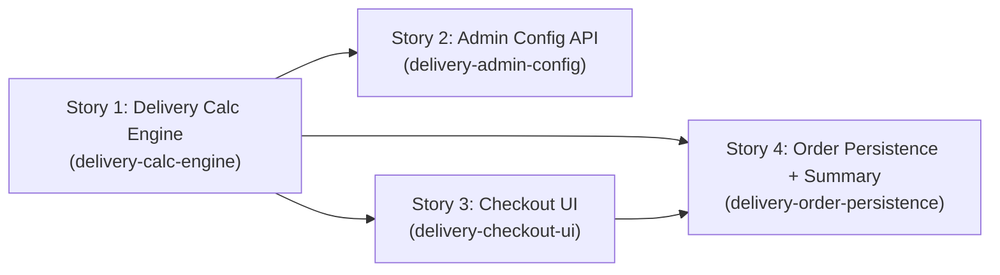

# Plan: Sprint 7 Delivery Overhaul — Value-Based Pricing and Zásilkovna Option

## Roadmap Overview

This plan implements the Sprint 7 delivery overhaul in four self-contained stories. The work
replaces the Sprint 6 weight-and-region-based delivery pricing with a value-based model (free
above €75, flat €5.95, +€20 oversized surcharge, €12.95 express) and introduces Zásilkovna
as a selectable delivery option for CZ and DACH addresses.

The selected solution stores delivery rules as a JSON document in the `settings` table,
Redis-cached by a new Laravel `DeliveryCalculatorService`. The Angular checkout step calls
`POST /delivery/calculate` and renders available options and costs reactively. A dedicated
admin endpoint (`PUT /admin/delivery-config`) allows rule updates without code deployment.

**4 stories, total estimated complexity: M+S+M+M = M-overall.** Stories 2 and 3 are
independently parallelisable after Story 1. Story 4 closes the loop on order persistence
and itemised confirmation display.

---

## Dependency Graph

---

## Stories

### Story 1: Delivery Calculation Engine

- **Slug:** `delivery-calc-engine`
- **Description:**
  Create the backend delivery calculation engine. This story delivers:

  1. **JSON config migration + seeder** — a DB migration that stores the delivery rules JSON
     document in the existing `settings` table (key: `delivery_config`), seeded with the
     initial Sprint 7 rule set (free threshold €75, flat rate €5.95, oversized surcharge €20,
     express €12.95, Zásilkovna regions CZ+DACH). Redis caching of this document with a
     configurable TTL.

  2. **`DeliveryCalculatorService`** — a Laravel service that reads the cached config and
     applies the rule pipeline:
     - Compute non-oversized item total (items with weight ≤25 kg)
     - Compute oversized flag (any item >25 kg)
     - Compute in-stock flag (all items in stock)
     - Determine Zásilkovna eligibility (shipping country in CZ, DE, AT, CH)
     - Apply base delivery cost: €0.00 (free) if non-oversized total >€75, else €5.95
     - Apply oversized surcharge: +€20.00 if oversized flag is true
     - Add Express option (€12.95) only if in-stock flag is true AND oversized flag is false
     - Filter delivery methods by regional eligibility

  3. **`DeliveryController` + `POST /delivery/calculate` route** — accepts a request body
     with `{ cart_items: [{product_id, weight_kg, price_eur, in_stock}], shipping_country }`,
     returns `{ delivery_options: [{method, label, base_cost_eur, available}], oversized_surcharge_eur }`.

  The `weight` field already exists on products. The endpoint must validate that all required
  fields are present and return 422 with a descriptive error if not.

  **References:**
  - PRD: `.sdlc/prds/sprint7-delivery-overhaul/prd.md`
  - US2450: `courses/GO-IT-Academy/HolisticTestingWithGenAI-ScrumMasterCommunity-20261012/sprint7-delivery-feature/US2450-delivery-cost.md`
  - US3150: `courses/GO-IT-Academy/HolisticTestingWithGenAI-ScrumMasterCommunity-20261012/sprint7-delivery-feature/US3150-delivery-option.md`

- **Business Acceptance Criteria covered:** BAC-1, BAC-2, BAC-3, BAC-4, BAC-5, BAC-6, BAC-7, BAC-8, BAC-9, BAC-10, BAC-11, BAC-14
- **Complexity:** M
- **Dependencies:** None — this is the foundation story
- **Independently deployable:** Yes — new endpoint and service; no existing endpoint changes; feature is dark until the Angular step (Story 3) calls it

- **Files created / modified:**
  - `sprint5/API/database/migrations/<timestamp>_add_delivery_config_to_settings.php` (new)
  - `sprint5/API/database/seeders/DeliveryConfigSeeder.php` (new)
  - `sprint5/API/app/Services/DeliveryCalculatorService.php` (new)
  - `sprint5/API/app/Http/Controllers/DeliveryController.php` (new)
  - `sprint5/API/routes/api.php` (modify — add `POST /delivery/calculate` route)
  - `sprint5/API/tests/Feature/DeliveryCalculationTest.php` (new)

- **Test names:**
  - `T1_deliveryCalc_nonOversizedCartAbove75EUR_standardDeliveryIsFree` (integration) → BAC-1
  - `T2_deliveryCalc_nonOversizedCartAt75EUR_standardDeliveryIs5_95EUR` (integration) → BAC-2
  - `T3_deliveryCalc_nonOversizedCartExactlyAt75EUR_flatRateApplied` (unit) → BAC-2
  - `T1_deliveryCalc_cartContainsItemOver25kg_oversizedSurcharge20EURApplied` (integration) → BAC-3
  - `T2_deliveryCalc_onlyOversizedItemInCart_baseDeliveryIs5_95AndSurchargeIs20EUR` (integration) → BAC-4
  - `T3_deliveryCalc_mixedCartOver75EURWithOversizedItem_baseIsFreeAndSurchargeIs20EUR` (integration) → BAC-5
  - `T1_deliveryCalc_allItemsInStockAndNoneOversized_expressOptionAvailableAt12_95EUR` (integration) → BAC-6
  - `T2_deliveryCalc_cartContainsOutOfStockItem_expressOptionNotReturned` (integration) → BAC-7
  - `T3_deliveryCalc_cartContainsOversizedItemAllInStock_expressOptionNotReturned` (integration) → BAC-8
  - `T4_deliveryCalc_cartContainsOversizedAndOutOfStock_expressBlockedByBothGates` (unit) → BAC-8
  - `T1_deliveryCalc_shippingCountryCZ_zasilkovnaOptionReturned` (integration) → BAC-9
  - `T2_deliveryCalc_shippingCountryDE_zasilkovnaOptionReturned` (integration) → BAC-9
  - `T3_deliveryCalc_shippingCountryOutsideCZandDACH_zasilkovnaNotReturned` (integration) → BAC-10
  - `T1_deliveryCalc_zasilkovnaSelectedCartAbove75EUR_deliveryCostIsFree` (integration) → BAC-11
  - `T2_deliveryCalc_zasilkovnaSelectedCartAt75EUR_deliveryCostIs5_95EUR` (integration) → BAC-11
  - `T1_deliveryCalc_configUpdatedInSettings_recalculationUsesNewRules` (integration) → BAC-14

---

### Story 2: Admin Delivery Config API

- **Slug:** `delivery-admin-config`
- **Description:**
  Add a protected admin endpoint that allows updating the delivery pricing rules without a
  code deployment.

  1. **`PUT /admin/delivery-config` route + `Admin\DeliveryConfigController`** — accepts the
     full delivery rules JSON. Validates the JSON against a defined schema (required keys:
     `free_threshold_eur`, `flat_rate_eur`, `oversized_surcharge_eur`, `express_rate_eur`,
     `zasilkovna_countries`). Rejects invalid payloads with a 422 and a field-level error
     message.

  2. **Config history** — before overwriting, serialize the current config into a versioned
     history slot (e.g., `delivery_config_history` key in settings, keeping the last 5
     snapshots as a JSON array).

  3. **Cache invalidation** — after a successful update, invalidate the Redis `delivery_config`
     cache key so the next request to `POST /delivery/calculate` picks up the new rules.

  4. **Auth gate** — endpoint is protected by the existing admin middleware (same gate as
     other admin routes in `api.php`).

  **References:**
  - PRD: `.sdlc/prds/sprint7-delivery-overhaul/prd.md`

- **Business Acceptance Criteria covered:** BAC-14
- **Complexity:** S
- **Dependencies:** Story 1 must complete first — establishes the `delivery_config` settings key and the Redis cache key that this story invalidates
- **Independently deployable:** Yes — new admin endpoint; does not affect the customer-facing flow until rules are intentionally changed via admin

- **Files created / modified:**
  - `sprint5/API/app/Http/Controllers/Admin/DeliveryConfigController.php` (new)
  - `sprint5/API/app/Http/Requests/UpdateDeliveryConfigRequest.php` (new)
  - `sprint5/API/routes/api.php` (modify — add `PUT /admin/delivery-config` route under admin middleware)
  - `sprint5/API/tests/Feature/Admin/DeliveryConfigTest.php` (new)

- **Test names:**
  - `T1_deliveryAdminConfig_validJsonConfigProvided_configUpdatedAndCacheInvalidated` (integration) → BAC-14
  - `T2_deliveryAdminConfig_invalidJsonSchemaMissingKey_requestRejectedWith422` (integration) → BAC-14
  - `T3_deliveryAdminConfig_successfulUpdate_previousConfigPreservedInHistory` (integration) → BAC-14
  - `T4_deliveryAdminConfig_unauthenticatedRequest_returns401` (integration) → BAC-14

---

### Story 3: Angular Checkout Delivery Step

- **Slug:** `delivery-checkout-ui`
- **Description:**
  Update the Angular checkout delivery step (step 3) to call the backend and render delivery
  options + costs reactively.

  1. **`DeliveryApiService`** — a new Angular service (`_services/delivery-api.service.ts`)
     that POSTs to `/delivery/calculate` with the current cart items (product_id, weight_kg,
     price_eur, in_stock) and shipping country, and returns typed `DeliveryOptionsResponse`.

  2. **`DeliveryOptions` DTOs** — `delivery-options-request.ts` and
     `delivery-options-response.ts` models under `app/models/`.

  3. **`DeliveryComponent` update** — update `checkout/delivery/delivery.component.ts` and
     `.html` to:
     - Call `DeliveryApiService.calculate()` on load and on return from cart changes
     - Display available delivery methods as a radio-button selection (Standard, Zásilkovna
       where eligible, Express where eligible)
     - Show base delivery cost, oversized surcharge (separate line), and total delivery cost
     - For Express and Zásilkovna: show/hide based on the `available` flag in the API response
     - When Express is unavailable, show a disabled state with an explanatory message
     - For unsupported destinations (API returns zero eligible methods): show a warning banner
       and disable the "Continue to Payment" button
     - Persist the selected `method` and costs in the checkout session state for submission

  4. **Data-test attributes** — add `data-test` attributes on key elements following the
     existing checkout pattern (e.g., `data-test="delivery-standard-option"`,
     `data-test="delivery-express-option"`, `data-test="delivery-oversized-surcharge"`,
     `data-test="delivery-total-cost"`, `data-test="delivery-error-unsupported-destination"`).

  **References:**
  - PRD: `.sdlc/prds/sprint7-delivery-overhaul/prd.md`
  - Existing payment component for reference: `sprint5/UI/src/app/checkout/payment/payment.component.ts`

- **Business Acceptance Criteria covered:** BAC-1, BAC-2, BAC-3, BAC-4, BAC-5, BAC-6, BAC-7, BAC-8, BAC-9, BAC-10, BAC-11, BAC-12 (delivery step), BAC-13, BAC-15
- **Complexity:** M
- **Dependencies:** Story 1 must complete first — needs `POST /delivery/calculate` endpoint to exist
- **Independently deployable:** Yes — changes are isolated to the Angular delivery step; does not affect backend data or other checkout steps

- **Files created / modified:**
  - `sprint5/UI/src/app/_services/delivery-api.service.ts` (new)
  - `sprint5/UI/src/app/models/delivery-options-request.ts` (new)
  - `sprint5/UI/src/app/models/delivery-options-response.ts` (new)
  - `sprint5/UI/src/app/checkout/delivery/delivery.component.ts` (modify)
  - `sprint5/UI/src/app/checkout/delivery/delivery.component.html` (modify)
  - `sprint5/UI/src/app/checkout/delivery/delivery.component.spec.ts` (new or modify)

- **Test names:**
  - `T1_deliveryUI_nonOversizedCartAbove75EUR_freeShippingLabelDisplayed` (unit/spec) → BAC-1
  - `T2_deliveryUI_nonOversizedCartAt75EUR_5_95FlatRateDisplayed` (unit/spec) → BAC-2
  - `T1_deliveryUI_cartContainsOversizedItem_20EURSurchargeShownAsSeparateLine` (unit/spec) → BAC-3
  - `T2_deliveryUI_onlyOversizedItemInCart_flatRatePlusSurchargeTotal25_95EUR` (unit/spec) → BAC-4
  - `T3_deliveryUI_mixedCartWith80EURNonOversized_freeShippingPlusSurchargeTotal20EUR` (unit/spec) → BAC-5
  - `T1_deliveryUI_allItemsInStockNoneOversized_expressOptionVisible` (unit/spec) → BAC-6
  - `T2_deliveryUI_cartContainsOutOfStockItem_expressOptionNotVisible` (unit/spec) → BAC-7
  - `T3_deliveryUI_cartContainsOversizedItem_expressOptionNotVisibleRegardlessOfStock` (unit/spec) → BAC-8
  - `T1_deliveryUI_shippingAddressCZ_zasilkovnaOptionDisplayed` (unit/spec) → BAC-9
  - `T2_deliveryUI_shippingAddressDACH_zasilkovnaOptionDisplayed` (unit/spec) → BAC-9
  - `T3_deliveryUI_shippingAddressOutsideCZandDACH_zasilkovnaOptionNotDisplayed` (unit/spec) → BAC-10
  - `T1_deliveryUI_zasilkovnaSelectedCartAbove75EUR_samePricingAsStandard` (unit/spec) → BAC-11
  - `T2_deliveryUI_zasilkovnaSelected_expressOptionNotAvailable` (unit/spec) → BAC-11
  - `T1_deliveryUI_deliveryMethodSelected_subtotalDeliveryCostAndTotalShownSeparately` (unit/spec) → BAC-12
  - `T1_deliveryUI_userReturnsTCartWithModifiedItems_deliveryCostRecalculated` (unit/spec) → BAC-13
  - `T5_deliveryUI_unsupportedShippingDestination_errorBannerDisplayedAndPaymentButtonDisabled` (unit/spec) → BAC-15
  - `T5_deliveryCheckout_customerSelectsZasilkovnaForCZAddress_orderCompletesWithCorrectCost` (e2e) → BAC-9, BAC-11, BAC-12

---

### Story 4: Order Persistence and Itemised Confirmation

- **Slug:** `delivery-order-persistence`
- **Description:**
  Persist the customer's delivery choice and costs with the order record, and display the
  itemised delivery breakdown on the order confirmation page.

  1. **DB migration** — add three columns to the `orders` table:
     `delivery_method` (varchar, e.g., `standard`, `zasilkova`, `express`),
     `delivery_base_cost_eur` (decimal 8,2),
     `delivery_oversized_surcharge_eur` (decimal 8,2, default 0.00).

  2. **`PaymentController` / checkout submission** — extend the `POST /payment/check`
     request handling to accept `{ delivery_method, delivery_base_cost_eur,
     delivery_oversized_surcharge_eur }` and write these values to the `Order` model on
     creation. Validate that `delivery_method` is one of the allowed values
     (`standard`, `zasilkova`, `express`). Return 422 if delivery fields are missing or invalid.

  3. **`Order` model** — add the three new fields to the `$fillable` array.

  4. **Order confirmation / invoice display** — update the Angular order-overview component
     (`checkout/order-overview/order-overview.component.ts` and `.html`) to read the
     persisted delivery fields from the invoice API response and render them as separate line
     items: "Delivery ({method label})", "Oversized item surcharge" (if non-zero), and the
     order total.

  5. **`data-test` attributes** on the confirmation page: `data-test="order-delivery-method"`,
     `data-test="order-delivery-cost"`, `data-test="order-oversized-surcharge"`,
     `data-test="order-total"`.

  **References:**
  - PRD: `.sdlc/prds/sprint7-delivery-overhaul/prd.md`
  - Existing payment component: `sprint5/UI/src/app/checkout/payment/payment.component.ts`

- **Business Acceptance Criteria covered:** BAC-3 (persistence), BAC-12 (confirmation page itemisation)
- **Complexity:** M
- **Dependencies:** Story 1 (delivery cost is calculated before submission) AND Story 3 (Angular must select and hold the delivery method before checkout submission); Story 2 is not a blocker
- **Independently deployable:** Yes with feature flag — the new DB columns are nullable with defaults; existing orders unaffected. The frontend change is additive (new line items on the confirmation page)

- **Files created / modified:**
  - `sprint5/API/database/migrations/<timestamp>_add_delivery_fields_to_orders.php` (new)
  - `sprint5/API/app/Models/Order.php` (modify — add fields to `$fillable`)
  - `sprint5/API/app/Http/Controllers/PaymentController.php` (modify — accept + persist delivery fields)
  - `sprint5/API/tests/Feature/OrderDeliveryPersistenceTest.php` (new)
  - `sprint5/UI/src/app/checkout/order-overview/order-overview.component.ts` (modify)
  - `sprint5/UI/src/app/checkout/order-overview/order-overview.component.html` (modify)

- **Test names:**
  - `T1_orderPersistence_checkoutCompletedWithStandardDelivery_deliveryMethodAndCostSavedToOrder` (integration) → BAC-12
  - `T2_orderPersistence_checkoutCompletedWithOversizedSurcharge_surchargeStoredSeparatelyOnOrder` (integration) → BAC-3, BAC-12
  - `T3_orderPersistence_checkoutSubmittedWithoutDeliveryFields_returns422` (integration) → BAC-12
  - `T4_orderPersistence_checkoutSubmittedWithInvalidDeliveryMethod_returns422` (integration) → BAC-12
  - `T1_orderConfirmation_deliveryMethodCostAndSurchargeDisplayedAsSeparateLines` (unit/spec) → BAC-12
  - `T2_orderConfirmation_noOversizedSurcharge_surchargeLineNotDisplayed` (unit/spec) → BAC-12

---

## Test Plan

| Story | Test Name | BAC | Type | What it verifies |
|---|---|---|---|---|
| 1 | `T1_deliveryCalc_nonOversizedCartAbove75EUR_standardDeliveryIsFree` | BAC-1 | integration | `POST /delivery/calculate` returns €0.00 base cost for standard when non-oversized total > €75 |
| 1 | `T2_deliveryCalc_nonOversizedCartAt75EUR_standardDeliveryIs5_95EUR` | BAC-2 | integration | Returns €5.95 when non-oversized total = €75 |
| 1 | `T3_deliveryCalc_nonOversizedCartExactlyAt75EUR_flatRateApplied` | BAC-2 | unit | Boundary: exactly €75 triggers flat rate, not free |
| 1 | `T1_deliveryCalc_cartContainsItemOver25kg_oversizedSurcharge20EURApplied` | BAC-3 | integration | Returns `oversized_surcharge_eur: 20.00` when any item > 25 kg |
| 1 | `T2_deliveryCalc_onlyOversizedItemInCart_baseDeliveryIs5_95AndSurchargeIs20EUR` | BAC-4 | integration | Non-oversized total = €0 → flat rate + surcharge = €25.95 |
| 1 | `T3_deliveryCalc_mixedCartOver75EURWithOversizedItem_baseIsFreeAndSurchargeIs20EUR` | BAC-5 | integration | Non-oversized total > €75 → free base + €20 surcharge = €20.00 total |
| 1 | `T1_deliveryCalc_allItemsInStockAndNoneOversized_expressOptionAvailableAt12_95EUR` | BAC-6 | integration | Express returned with `available: true` at €12.95 |
| 1 | `T2_deliveryCalc_cartContainsOutOfStockItem_expressOptionNotReturned` | BAC-7 | integration | Express not present in response when any item `in_stock: false` |
| 1 | `T3_deliveryCalc_cartContainsOversizedItemAllInStock_expressOptionNotReturned` | BAC-8 | integration | Express not present when any item > 25 kg, even if all in stock |
| 1 | `T4_deliveryCalc_cartContainsOversizedAndOutOfStock_expressBlockedByBothGates` | BAC-8 | unit | Both gates independently block Express |
| 1 | `T1_deliveryCalc_shippingCountryCZ_zasilkovnaOptionReturned` | BAC-9 | integration | Zásilkovna in response for shipping_country=CZ |
| 1 | `T2_deliveryCalc_shippingCountryDE_zasilkovnaOptionReturned` | BAC-9 | integration | Zásilkovna in response for shipping_country=DE |
| 1 | `T3_deliveryCalc_shippingCountryOutsideCZandDACH_zasilkovnaNotReturned` | BAC-10 | integration | Zásilkovna absent from response for e.g. shipping_country=US |
| 1 | `T1_deliveryCalc_zasilkovnaSelectedCartAbove75EUR_deliveryCostIsFree` | BAC-11 | integration | Zásilkovna base cost is €0.00 when non-oversized total > €75 |
| 1 | `T2_deliveryCalc_zasilkovnaSelectedCartAt75EUR_deliveryCostIs5_95EUR` | BAC-11 | integration | Zásilkovna base cost is €5.95 when non-oversized total = €75 |
| 1 | `T1_deliveryCalc_configUpdatedInSettings_recalculationUsesNewRules` | BAC-14 | integration | After settings update, new prices reflected in calculate response |
| 2 | `T1_deliveryAdminConfig_validJsonConfigProvided_configUpdatedAndCacheInvalidated` | BAC-14 | integration | PUT returns 200; new config applies on next calculate call |
| 2 | `T2_deliveryAdminConfig_invalidJsonSchemaMissingKey_requestRejectedWith422` | BAC-14 | integration | Missing required key → 422 with field-level error |
| 2 | `T3_deliveryAdminConfig_successfulUpdate_previousConfigPreservedInHistory` | BAC-14 | integration | Old config appears in history key after update |
| 2 | `T4_deliveryAdminConfig_unauthenticatedRequest_returns401` | BAC-14 | integration | No admin token → 401 |
| 3 | `T1_deliveryUI_nonOversizedCartAbove75EUR_freeShippingLabelDisplayed` | BAC-1 | unit | Component shows "Free Shipping" label |
| 3 | `T2_deliveryUI_nonOversizedCartAt75EUR_5_95FlatRateDisplayed` | BAC-2 | unit | Component shows €5.95 |
| 3 | `T1_deliveryUI_cartContainsOversizedItem_20EURSurchargeShownAsSeparateLine` | BAC-3 | unit | Surcharge line visible in order summary |
| 3 | `T2_deliveryUI_onlyOversizedItemInCart_flatRatePlusSurchargeTotal25_95EUR` | BAC-4 | unit | Total delivery cost displayed as €25.95 |
| 3 | `T3_deliveryUI_mixedCartWith80EURNonOversized_freeShippingPlusSurchargeTotal20EUR` | BAC-5 | unit | Total delivery cost displayed as €20.00 |
| 3 | `T1_deliveryUI_allItemsInStockNoneOversized_expressOptionVisible` | BAC-6 | unit | Express radio button is enabled |
| 3 | `T2_deliveryUI_cartContainsOutOfStockItem_expressOptionNotVisible` | BAC-7 | unit | Express radio button absent or disabled with message |
| 3 | `T3_deliveryUI_cartContainsOversizedItem_expressOptionNotVisibleRegardlessOfStock` | BAC-8 | unit | Express absent even when in_stock=true for oversized item |
| 3 | `T1_deliveryUI_shippingAddressCZ_zasilkovnaOptionDisplayed` | BAC-9 | unit | Zásilkovna radio button visible |
| 3 | `T2_deliveryUI_shippingAddressDACH_zasilkovnaOptionDisplayed` | BAC-9 | unit | Zásilkovna radio button visible for DE, AT, CH |
| 3 | `T3_deliveryUI_shippingAddressOutsideCZandDACH_zasilkovnaOptionNotDisplayed` | BAC-10 | unit | Zásilkovna radio button absent |
| 3 | `T1_deliveryUI_zasilkovnaSelectedCartAbove75EUR_samePricingAsStandard` | BAC-11 | unit | Free shipping shown for Zásilkovna when eligible |
| 3 | `T2_deliveryUI_zasilkovnaSelected_expressOptionNotAvailable` | BAC-11 | unit | Express not shown when Zásilkovna is selected |
| 3 | `T1_deliveryUI_deliveryMethodSelected_subtotalDeliveryCostAndTotalShownSeparately` | BAC-12 | unit | Three separate line items rendered |
| 3 | `T1_deliveryUI_userReturnsFromCartWithModifiedItems_deliveryCostRecalculated` | BAC-13 | unit | API called again on component re-init after cart change |
| 3 | `T5_deliveryUI_unsupportedShippingDestination_errorBannerDisplayedAndPaymentButtonDisabled` | BAC-15 | unit | Error banner visible; continue button disabled |
| 3 | `T5_deliveryCheckout_customerSelectsZasilkovnaForCZAddress_orderCompletesWithCorrectCost` | BAC-9, BAC-11, BAC-12 | e2e | Full checkout flow with Zásilkovna in CZ |
| 4 | `T1_orderPersistence_checkoutCompletedWithStandardDelivery_deliveryMethodAndCostSavedToOrder` | BAC-12 | integration | Order record contains delivery_method + delivery_base_cost_eur |
| 4 | `T2_orderPersistence_checkoutCompletedWithOversizedSurcharge_surchargeStoredSeparatelyOnOrder` | BAC-3, BAC-12 | integration | Order record contains non-zero delivery_oversized_surcharge_eur |
| 4 | `T3_orderPersistence_checkoutSubmittedWithoutDeliveryFields_returns422` | BAC-12 | integration | Missing delivery_method → 422 |
| 4 | `T4_orderPersistence_checkoutSubmittedWithInvalidDeliveryMethod_returns422` | BAC-12 | integration | Unknown delivery_method value → 422 |
| 4 | `T1_orderConfirmation_deliveryMethodCostAndSurchargeDisplayedAsSeparateLines` | BAC-12 | unit | Confirmation page shows three delivery-related line items |
| 4 | `T2_orderConfirmation_noOversizedSurcharge_surchargeLineNotDisplayed` | BAC-12 | unit | Surcharge line hidden when surcharge = €0.00 |

---

## BAC Coverage Matrix

| BAC | Stories | Tests | Covered? |
|---|---|---|---|
| BAC-1 | Story 1, Story 3 | T1_deliveryCalc_nonOversizedCartAbove75EUR_…, T1_deliveryUI_nonOversizedCartAbove75EUR_… | ✓ |
| BAC-2 | Story 1, Story 3 | T2_deliveryCalc_nonOversizedCartAt75EUR_…, T3_deliveryCalc_nonOversizedCartExactlyAt75EUR_…, T2_deliveryUI_nonOversizedCartAt75EUR_… | ✓ |
| BAC-3 | Story 1, Story 3, Story 4 | T1_deliveryCalc_cartContainsItemOver25kg_…, T1_deliveryUI_cartContainsOversizedItem_…, T2_orderPersistence_checkoutCompletedWithOversizedSurcharge_… | ✓ |
| BAC-4 | Story 1, Story 3 | T2_deliveryCalc_onlyOversizedItemInCart_…, T2_deliveryUI_onlyOversizedItemInCart_… | ✓ |
| BAC-5 | Story 1, Story 3 | T3_deliveryCalc_mixedCartOver75EURWithOversizedItem_…, T3_deliveryUI_mixedCartWith80EURNonOversized_… | ✓ |
| BAC-6 | Story 1, Story 3 | T1_deliveryCalc_allItemsInStockAndNoneOversized_…, T1_deliveryUI_allItemsInStockNoneOversized_… | ✓ |
| BAC-7 | Story 1, Story 3 | T2_deliveryCalc_cartContainsOutOfStockItem_…, T2_deliveryUI_cartContainsOutOfStockItem_… | ✓ |
| BAC-8 | Story 1, Story 3 | T3_deliveryCalc_cartContainsOversizedItemAllInStock_…, T4_deliveryCalc_cartContainsOversizedAndOutOfStock_…, T3_deliveryUI_cartContainsOversizedItem_… | ✓ |
| BAC-9 | Story 1, Story 3 | T1/T2_deliveryCalc_shippingCountryCZ/DE_…, T1/T2_deliveryUI_shippingAddressCZ/DACH_…, T5_deliveryCheckout_customerSelectsZasilkovna… | ✓ |
| BAC-10 | Story 1, Story 3 | T3_deliveryCalc_shippingCountryOutsideCZandDACH_…, T3_deliveryUI_shippingAddressOutsideCZandDACH_… | ✓ |
| BAC-11 | Story 1, Story 3 | T1/T2_deliveryCalc_zasilkovnaSelected_…, T1/T2_deliveryUI_zasilkovnaSelected_…, T5_deliveryCheckout_customerSelectsZasilkovna… | ✓ |
| BAC-12 | Story 3, Story 4 | T1_deliveryUI_deliveryMethodSelected_…, T1/T2_orderPersistence_…, T1/T2_orderConfirmation_…, T5_deliveryCheckout_… | ✓ |
| BAC-13 | Story 3 | T1_deliveryUI_userReturnsFromCartWithModifiedItems_… | ✓ |
| BAC-14 | Story 1, Story 2 | T1_deliveryCalc_configUpdatedInSettings_…, T1–T4_deliveryAdminConfig_… | ✓ |
| BAC-15 | Story 3 | T5_deliveryUI_unsupportedShippingDestination_… | ✓ |

**All 15 BACs covered. No gaps.**

---

## Sequencing Strategy

**Critical path:** Story 1 → Story 3 → Story 4 (longest chain; ~3 sprint iterations if sequential)

**Parallel band after Story 1:**
- Story 2 (admin config API) and Story 3 (Angular checkout UI) can be implemented in parallel — they touch no overlapping files.
- Story 2 is S complexity and can likely be done within the same sprint iteration as Story 1.

**Deployment order:**
1. Deploy Story 1 first — the new `POST /delivery/calculate` endpoint is dark (not yet wired to the UI). No impact on existing checkout behavior.
2. Deploy Story 2 alongside or immediately after Story 1 — admin can now update delivery rules. Still no customer impact.
3. Deploy Story 3 — this is the first customer-visible change. The delivery step now calls the new engine. Recommend a staged rollout or feature flag.
4. Deploy Story 4 — adds delivery persistence and itemised confirmation. Safe to deploy once Story 3 is stable.

**File-overlap safety:**
- `api.php` is modified by Story 1 (add `/delivery/calculate`) and Story 2 (add `/admin/delivery-config`). These are different sections of the file. Story 2 is sequenced after Story 1 to prevent merge conflicts.
- No other file overlaps between stories. Stories 2, 3, and 4 can be reviewed and merged independently after Story 1 lands.

---

## External Action Items

No external repository changes required. Delivery config JSON seeding is handled by a DB
migration + seeder in the main ToolShop API repository. No K8s manifests, Helm charts, or
CI pipeline changes are needed for this feature.

---

## References (carried from PRD)

- [US2450 — Delivery Costs Calculation](courses/GO-IT-Academy/HolisticTestingWithGenAI-ScrumMasterCommunity-20261012/sprint7-delivery-feature/US2450-delivery-cost.md)
- [US3150 — New Delivery Option (Zásilkovna)](courses/GO-IT-Academy/HolisticTestingWithGenAI-ScrumMasterCommunity-20261012/sprint7-delivery-feature/US3150-delivery-option.md)
- [US4200 — Sprint 6 Delivery Options (superseded)](systemsUnderTest/toolShop/backlog-V6CZ/US4200-delivery-costs.md)
- [Sprint 6 Agile Vision Statement](systemsUnderTest/toolShop/backlog-V6CZ/sprint6-agile-vision-statement.md)
- [ToolShop Practice App](https://practicesoftwaretesting.com/)
- [ToolShop GitHub Repository](https://github.com/testsmith-io/practice-software-testing)
- [ToolShop API Documentation](https://github.com/testsmith-io/practice-software-testing/tree/main/docs)
