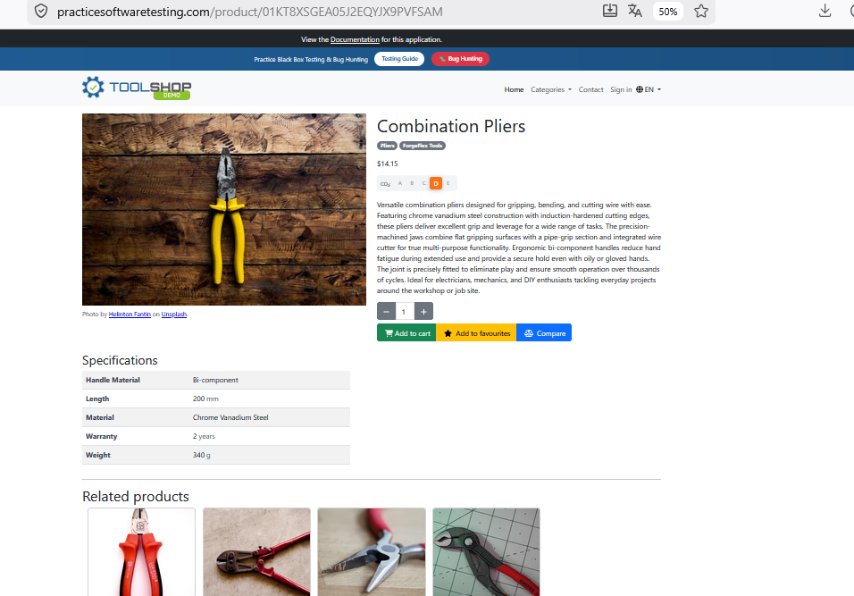
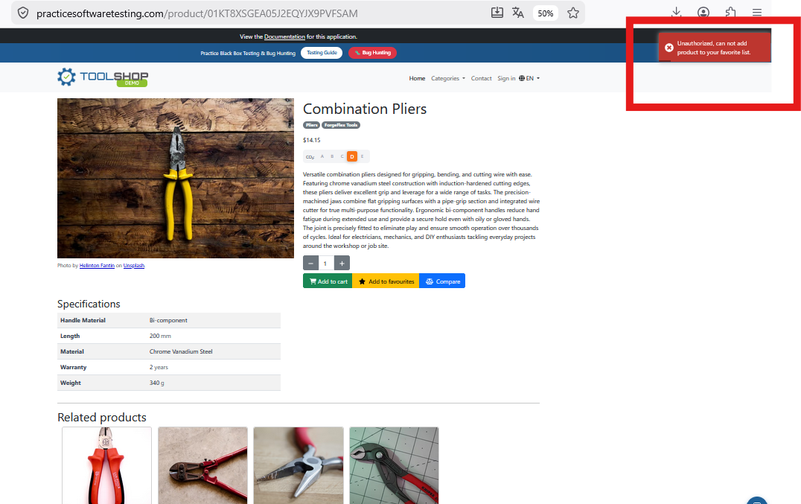

# Apply Test Activities and Tasks on Toolshop

## Reference to ISTQB Syllabus Chapter

ISTQB FL – 1.4.1 Test Activities and Tasks

## Link to the Transfer Task File

https://github.com/JulietaTz/RBI-AgileEngineeringFoundation/blob/main/courses/TestBusters-LearningLab/ISTQB-2026/foundationLevel/transferTasks/ISTQB-FL-1.4.1_Test_Activities_and_Tasks_20260405.md

## Outcome

### Artifact Type

Test Case Execution Report

### Artifact Purpose

This artifact documents the execution of a test case for the Toolshop Product Detail Page and demonstrates the application of ISTQB FL 1.4.1 Test Activities and Tasks.

### Selected Feature Flow

Product Detail Page

### Website Under Test

https://practicesoftwaretesting.com/

### Requirement / Assumption

When a user opens a product detail page, all relevant product information should be displayed correctly. Users should also be able to interact with available actions such as Add to Cart, Add to Favourites, and Compare.

### Test Preconditions

* Access to https://practicesoftwaretesting.com/
* User is not logged in
* Product "Combination Pliers" is available

### Application of Test Activities and Tasks

| Test Activity       | Task Applied                                                                                                           |
| ------------------- | ---------------------------------------------------------------------------------------------------------------------- |
| Test Analysis       | Identified the Product Detail Page as the test object and analyzed expected product information and available actions. |
| Test Design         | Created a test case covering displayed information and user actions.                                                   |
| Test Implementation | Prepared test data and execution steps for the selected product.                                                       |
| Test Execution      | Executed the test and verified product details and available actions.                                                  |
| Test Completion     | Documented results and assessed quality risks.                                                                         |

### Test Execution Evidence

| Item          | Details                        |
| ------------- | ------------------------------ |
| Test Case ID  | TC-PDP-001                     |
| Product       | Combination Pliers             |
| Product Price | $14.15                         |
| Environment   | Practice Software Testing Demo |
| Status        | Passed                         |

#### Screenshot 1

*Figure 1: Product Detail Page for Combination Pliers showing product information, specifications, quantity selector and available actions.*

#### Screenshot 2

*Figure 2: Unauthorized message displayed when attempting to add a product to favourites while not logged in.*

### Test Case

#### Objective

Verify that the Product Detail Page displays correct product information and that available actions behave as expected.

#### Steps

1. Open https://practicesoftwaretesting.com/
2. Select the product **Combination Pliers**.
3. Verify that the product image is displayed.
4. Verify that the product name is displayed correctly.
5. Verify that the product price is displayed correctly.
6. Verify that the product description is displayed.
7. Verify that the specifications section is displayed.
8. Verify that the quantity selector is available and can be adjusted.
9. Click **Add to Cart** and verify that the product is added to the shopping cart.
10. Click **Add to Favourites**.
11. Verify that the application prevents the action and displays an authorization message for unauthenticated users.
12. Click **Compare** and verify that the product is added to the comparison list.

#### Expected Result

* Product image is visible.
* Product name is displayed correctly.
* Product price is displayed correctly.
* Product description is displayed.
* Specifications are displayed.
* Quantity selector works correctly.
* Product can be added to the shopping cart.
* When a non-authenticated user clicks **Add to Favourites**, the application prevents the action and displays an authorization message.
* Product can be added to the comparison list.

#### Actual Result

* Product image displayed correctly.
* Product name displayed correctly.
* Product price displayed correctly.
* Product description displayed correctly.
* Specifications displayed correctly.
* Quantity selector worked correctly.
* Product was successfully added to the shopping cart.
* When **Add to Favourites** was selected, the application displayed the message:
  **"Unauthorized, can not add product to your favorite list."**
* This confirms that authentication is required before a product can be added to favourites.
* Product was successfully added to the comparison list.

#### Test Status

**Passed**

### Risk and Quality Impact

| Risk                                                      | Impact                                          |
| --------------------------------------------------------- | ----------------------------------------------- |
| Missing or incorrect product information                  | Users may make incorrect purchasing decisions.  |
| Add to Cart button does not work                          | Users cannot purchase products.                 |
| Favourite functionality accessible without authentication | Unauthorized users could bypass business rules. |
| Compare button does not work                              | Users cannot compare products effectively.      |
| Incorrect price displayed                                 | Business and customer satisfaction risk.        |

### Learning Summary

| Test Activity       | One-line Takeaway                                                      |
| ------------------- | ---------------------------------------------------------------------- |
| Test Analysis       | Identify what needs to be tested and determine the expected behaviour. |
| Test Design         | Define test conditions, test data and expected results.                |
| Test Implementation | Prepare the test environment and execution steps.                      |
| Test Execution      | Execute the test and compare actual versus expected results.           |
| Test Completion     | Document findings and communicate quality risks.                       |

> Applying ISTQB test activities and tasks helps transform a simple feature review into a structured, traceable testing activity that supports product quality and reduces release risk.
