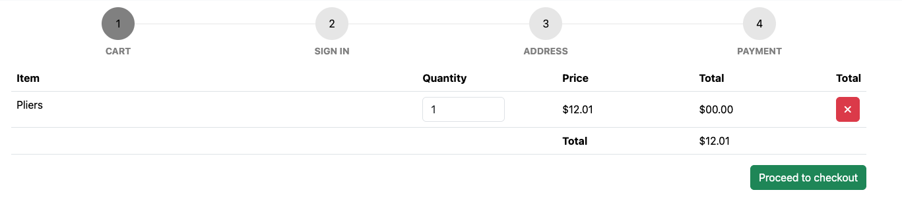
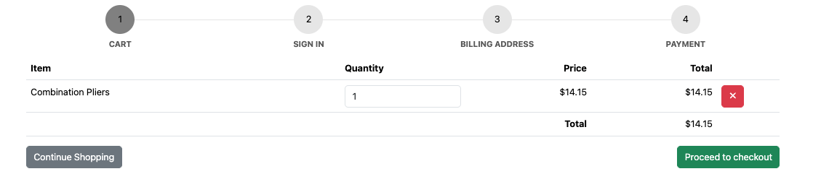
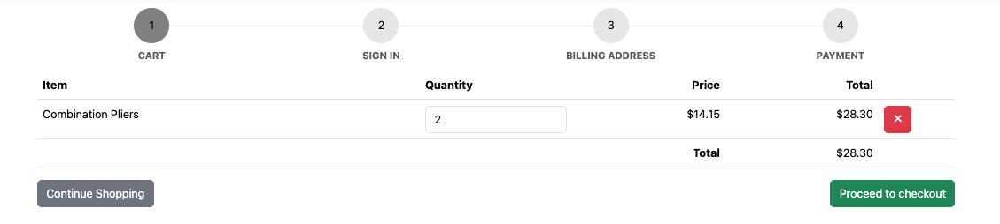
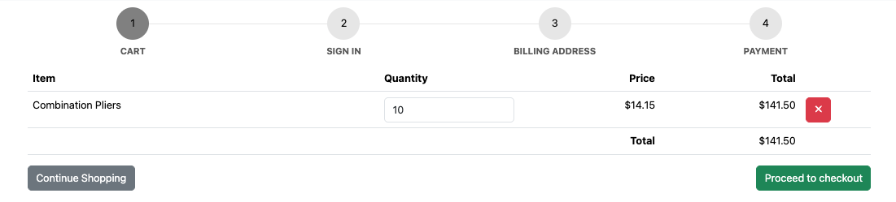

# Apply Confirmation Testing and Regression Testing on Toolshop

## Reference to ISTQB Syllabus chapter
ISTQB FL – 2.2.3 Confirmation Testing and Regression Testing

## Link to the transfer task file
https://github.com/rgroetz2/TBLL-AgileEngineeringFoundation/blob/main/courses/TestBusters-LearningLab/ISTQB-2026/foundationLevel/transferTasks/Chapter%202/ISTQB-FL-2.2.3_Confirmation_Testing_and_Regression_Testing_20260405.md

## Outcome

# Confirmation and Regression Testing on Toolshop

## Selected Feature Flow

Checkout - Cart Review

## Requirement / Behavior Reference

According to the Sprint 5 user story **Checkout – Cart Review**, the checkout page should display the cart contents including the item quantity, price, and total.

The following acceptance criteria are relevant to the selected issue:

- **AC1 – Cart contents displayed:** When the customer navigates to the checkout page with items in the cart, the cart table should display Item, Quantity, Price, Total, and Actions.
- **AC2 – Update quantity:** When the quantity of a cart item is changed, the item total and cart total should be recalculated and the message `Product quantity updated.` should be displayed.

These acceptance criteria provide the expected behavior for checking the reported issue where the checkout total price displays `0,00`.

## Known Issue / Fix Area

**Feature:** Checkout – Cart

**Known issue:** Total price displays `0,00`.

**Expected behavior:** The checkout cart should display the correctly calculated total price based on the products and their quantities.

### Evidence – Before Fix

In Sprint 5 with bugs, the checkout cart displays the total price as `0,00`.

## Confirmation Test

The same checkout scenario was re-tested in the corrected Sprint 5 version.

| Item | Observation |
|---|---|
| Steps | Add a product to the cart and open the checkout page. |
| Input | Product with quantity 1 |
| Expected Result | The correct total price should be displayed instead of `0,00`. |
| Actual Result | The Correct total price was displayed. |
| Result | PASS |
| Risk / Quality Impact | An incorrect total price can prevent the customer from verifying the correct purchase amount. |

### Evidence – After Fix

## Regression Test Subset

### Regression Test 1 – Update Product Quantity

| Item | Observation |
|---|---|
| Related requirement | Checkout – Cart Review, AC2 – Update quantity |
| Steps | Change the quantity of the product in the checkout cart and repeat the test with different quantities. |
| Input | Quantity `2` and `10` |
| Expected Result | The item total and cart total should be recalculated correctly according to the selected quantity. |
| Actual Result | The totals were recalculated correctly for both quantity `2` and quantity `10`. |
| Result | PASS |
| Risk / Quality Impact | A defect in quantity calculation could cause customers to see or pay an incorrect order total. |

### Regression Test 2 – Delete Product from Cart

| Item | Observation |
|---|---|
| Related requirement | Checkout – Cart Review, AC3 – Delete item |
| Steps | Add products to the cart, navigate to checkout, and delete one product from the cart. |
| Expected Result | The selected product should be removed and the cart total should be recalculated correctly. |
| Actual Result | The product was removed successfully and the cart total was recalculated correctly. |
| Result | PASS |
| Risk / Quality Impact | A defect could cause the cart total to remain incorrect after removing an item. |

### Regression Test 3 – Proceed with Product in Cart

| Item | Observation |
|---|---|
| Related requirement | Checkout – Cart Review, AC5 – Proceed |
| Steps | Keep at least one product in the cart and click **Proceed**. |
| Expected Result | The checkout should advance to the next step. |
| Actual Result | The checkout advanced to the next step. Since the user was not logged in, the login step was displayed. |
| Result | PASS |
| Risk / Quality Impact | A defect could prevent customers with valid cart contents from continuing the checkout process. |

## Sprint-ready Conclusion

The known checkout total-price issue was successfully re-tested in the corrected Sprint 5 version, and the total price was calculated correctly. A small regression subset covering quantity updates, item deletion, and proceeding to the next checkout step also passed. No regression issues were observed in the tested cart functionality.

## Learning Summary

| Concept | One-line takeaway |
|---|---|
| Confirmation Testing | Re-tests a previously reported defect after a fix to verify that the original problem has been resolved. |
| Regression Testing | Checks related functionality to ensure that a change or fix has not introduced defects in previously working areas. |
| Confirmation Test Result | The checkout total-price issue was no longer present in the corrected Sprint 5 version. |
| Regression Scope | A small set of related cart functions was tested instead of re-testing the entire application. |
| Quantity Update | Changing the quantity to different values recalculated the total correctly. |
| Item Removal | Removing an item correctly updated the cart and its total. |
| Checkout Proceed | A cart containing at least one item could successfully proceed to the next checkout step. |